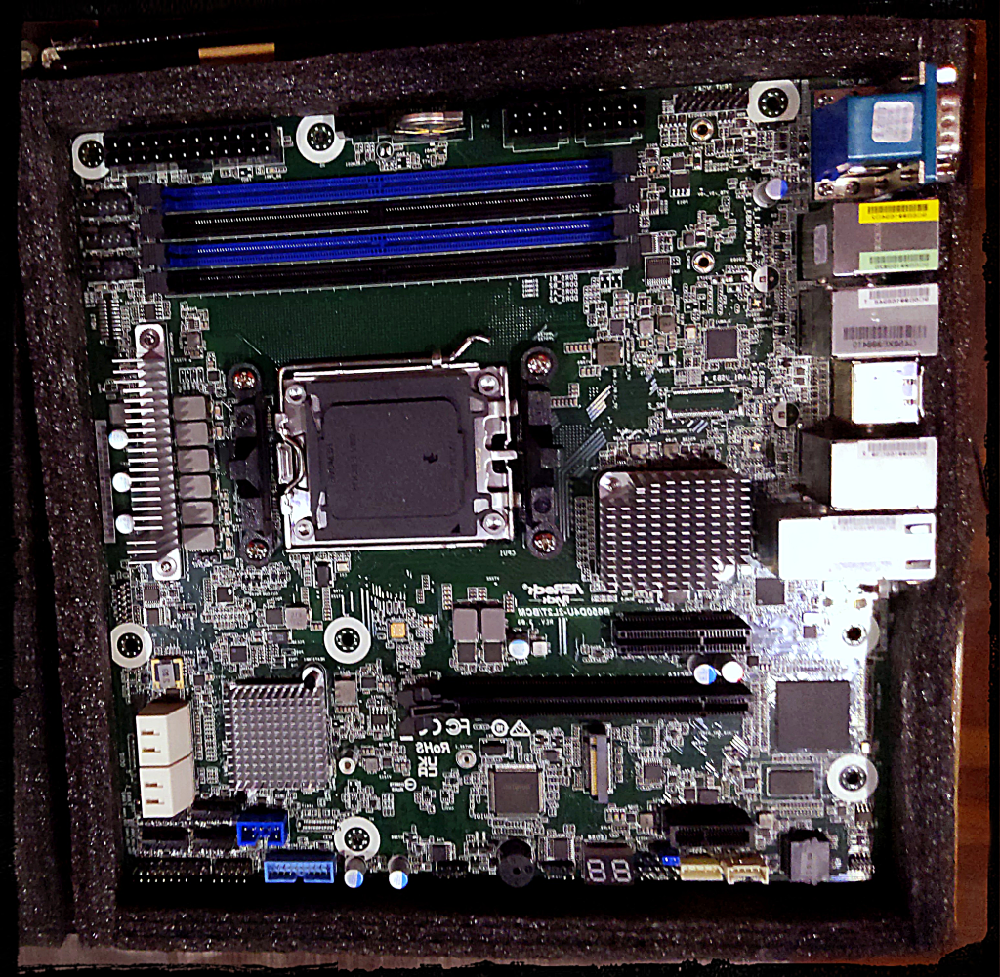
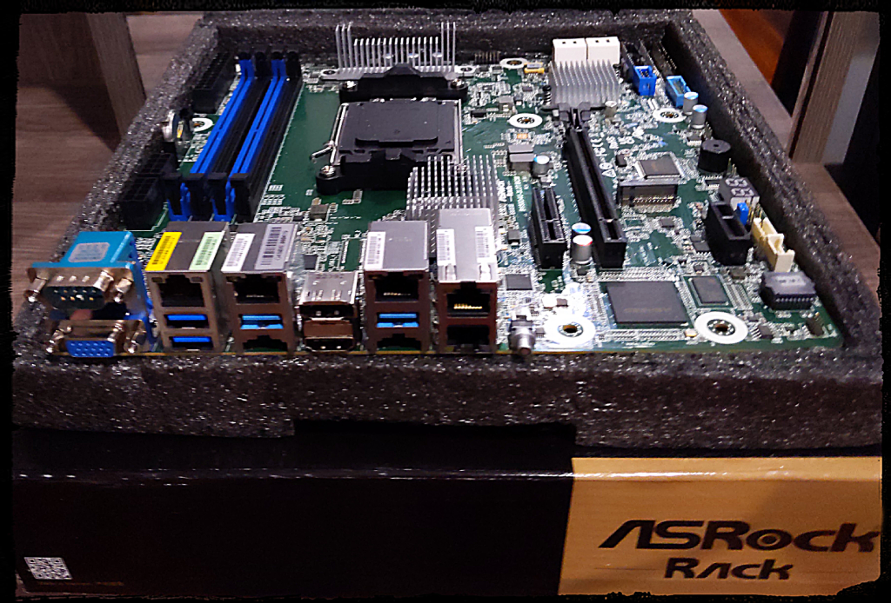

# BKK03 - Bootnode

## CPU

[AMD Ryzen™ 9 7950X3D 16-Core 32-Thread 5NM](https://www.amd.com/en/products/apu/amd-ryzen-9-7950x3d)

At the core of our server operations sits the impressive AMD Ryzen 9 7950X3D.
With a 16-core, it's tailored to manage multiple tasks with ease - enabling
multiple networks to be run simultaneously. The high core clock speeds are
paramount in blockchain applications, enabling efficient sync of chains and
reliable endpoint service.

Supporting cutting-edge PCI Express® 5.0 and DDR5 memory technologies, this CPU
ensures rapid data transfer and retrieval - essential for efficient and low
latency blockchain transactions. Its large  128MB L3 cache further enhances
performance by allowing quick access to frequently used data.

## CPU Cooler
[COOLSERVER P32 CPU Cooler](https://aliexpress.com/item/1005004050053958.html)

The COOLSERVER P32 AM5 Server CPU Cooler

[Thermalright aluminium alloy AM5 frame](https://aliexpress.com/item/1005004904430608.html)
Boost cooling capability we use Thermalright AM5 frame to increase performance.


## Motherboard



[AsRock Rack B650D4U-2L2T/BCM(LGA 1718) Dual 10G LAN](https://www.amazon.com/dp/B0BXRFHDQT)

This motherboard is a masterpiece of engineering and design, a testament to
AsRock's ability to merge the high-performance aspects of the consumer world
with the robustness and dependability of server-grade hardware. The Rack
B650D4U-2L2T is a Micro-ATX motherboard that fully supports DDR5 ECC UDIMM
memories, a feature that provides increased data integrity and system
reliability - essential elements in server environments.

The motherboard comes with full PCIe 5.0 support, which is crucial for tackling
demanding tasks and ensuring optimal performance. It features an M.2 slot, a
x16 slot, and a x4 slot, which provides the flexibility to cater to various
expansion needs. With the ability to support up to 7 M.2 slots, the Rack
B650D4U-2L2T is well-suited for high-performance NVMe storage, significantly
boosting data access and transfer speeds.

In essence, the AsRock Rack B650D4U-2L2T is an optimal choice that promises a
perfect blend of speed, reliability, and scalability, capable of serving the
demanding needs of modern server applications.

## Memory
[4x Server Memory Module|MICRON|DDR5|32GB|UDIMM/ECC|4800MHz|CL 40|1.1V|MTC20C2085S1EC48BA1R](https://www.amazon.com/Server-Memory-Module-4800MHz-MTC20C2085S1EC48BA1R)

Our server setup employs four modules of 32GB DDR5 server memory. These memory
modules ensure substantial bandwidth, which is paramount in maintaining smooth
and efficient server operations. Furthermore, these memory modules come
equipped with ECC (Error-Correcting Code) technology, an invaluable feature
that ensures the accuracy and integrity of data, a critical aspect in
preserving the trustworthiness of our transactions and operations.

In high-performance computing, latency is as crucial as speed. Lower latency
leads to faster data processing, resulting in more efficient and responsive
system performance. Our memory modules have demonstrated impressive low-latency
performance in our extensive testing.

## SSD Expansion Cards
[NVMe SSD Expansion Card NVMe PCIe RAID Adapter 4 Ports NVME SSD To PCI-E 4.0 X16 Expansion Card]()

Our selection of this SSD expansion card is an integral part of our data
management strategy. The card facilitates the incorporation of state-of-the-art
NVMe SSDs, which are renowned for their superlative speed and efficiency in
storage and data retrieval. By enabling faster access to stored data, this card
aids in optimizing overall system performance, significantly enhancing our
server's responsiveness.

There is also card for 1x slot with ricer as well as x4 card to utilize x4
PCIe5.0 slot later bringing fast disk space over 10Tb.

## Storage
[5x 2TB Hanye ME70 NVMe PCI-E4.0 7200mb/s](https://www.amazon.co.jp/Hanye-%E3%80%90PS5%E5%8B%95%E4%BD%9C%E7%A2%BA%E8%AA%8D%E6%B8%88%E3%81%BF%E3%80%91-PCIe-Gen4x4-DRAM%E6%90%AD%E8%BC%89/dp/B0B58JXNXG)

Our system utilizes six 2TB High Performance ME70 M.2 NVMe SSDs, offering a
total of 12TB high-speed storage, tailored for professionals needing quick data
access and load times. Utilizing Gen4 PCIe tech, these SSDs deliver sequential
read speeds of 7200 MB/s, combined with a powerful error correction algorithm,
LDPC (Low Density Parity Check), and DRAM cache for improved response times and
data integrity - making them an essential asset in our high-demand network
operations.

## Benchmark of zpool
```
2023-07-31 13:55:08 Running machine benchmarks...
2023-07-31 13:55:34
+----------+----------------+-------------+-------------+-------------------+
| Category | Function       | Score       | Minimum     | Result            |
+===========================================================================+
| CPU      | BLAKE2-256     | 1.56 GiBs   | 783.27 MiBs | ✅ Pass (203.8 %) |
|----------+----------------+-------------+-------------+-------------------|
| CPU      | SR25519-Verify | 788.10 KiBs | 560.67 KiBs | ✅ Pass (140.6 %) |
|----------+----------------+-------------+-------------+-------------------|
| Memory   | Copy           | 27.73 GiBs  | 11.49 GiBs  | ✅ Pass (241.3 %) |
|----------+----------------+-------------+-------------+-------------------|
| Disk     | Seq Write      | 2.99 GiBs   | 950.00 MiBs | ✅ Pass (322.0 %) |
|----------+----------------+-------------+-------------+-------------------|
| Disk     | Rnd Write      | 1.29 GiBs   | 420.00 MiBs | ✅ Pass (313.4 %) |
+----------+----------------+-------------+-------------+-------------------+
From 5 benchmarks in total, 5 passed and 0 failed (10% fault tolerance).
2023-07-31 13:55:34 The hardware meets the requirements
Read Latency Statistics in nanoseconds:
-------------------------
Minimum: 520 ns
Maximum: 22540 ns
Mean: 914.595734 ns
Standard Deviation: 222.087316 ns
Read IOPS: 953140.861971
```

## Chassis

[1U Case, TGC H1-400](https://www.pcgallery.co.th/product/tgc-h1-400/)

## Power Supply Unit

400W Compuware 80 PLUS Platinum PSU from [PC Gallery](https://www.pcgallery.co.th/)


## KVM
[Asrock Rack BCM/IPMI]

AsRock Rack motherboard comes with BCM for remote control.
