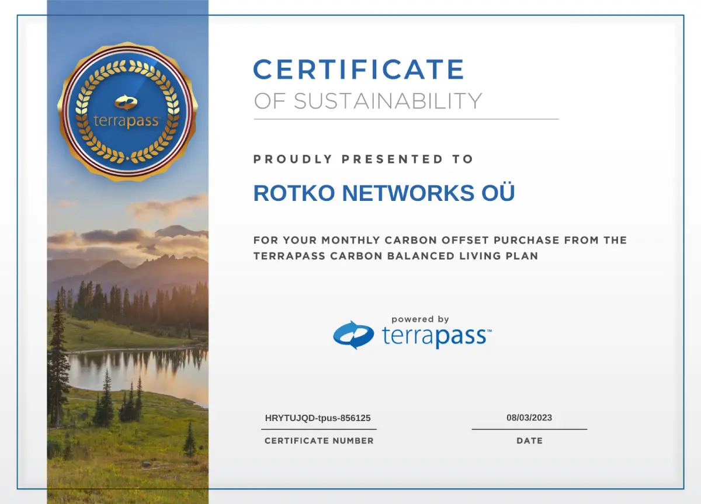

# Energy Consumption and Carbon Offset

**Energy Consumption**

We meticulously engineer our server infrastructure, selecting the most
energy-efficient devices the market can provide for the amount of computation
required. Our approach is proven by the actual consumption rate, which is lower
than the manufacturer's estimates.

* **Processor Selection:**
  * 2x AMD Ryzen 5600G: 65W
  * 1x AMD Ryzen 5950X: 170W
  * 1x AMD Ryzen 5950X3D: 120W
  * 1x AMD EPYC 9654: 360W
  * 1x AMD EPYC 7642: 280W 
  * MikroTik CCR2004-16G-2S+: Max 35W
  * MikroTik CCR2004-16G-2S+: Max 35W
  * MikroTik CCR2116-12G-4S+: Max 

* **Monthly Energy Consumption Estimate:**
  * Total Power: 2 * 65W (5600G) + 170W (5950X) + 120W (5950X3D) + 35W (router) + 360W (EPYC9654) = 815W
  * Monthly: 0.815 kW * 24 hours/day * 30 days/month = 586.8 kWh 
  * CO2e Emissions (Thailand's 2021 average): 330.62 kg or 0.33 metric tons (mt)

Our selection of processors and devices, including the MikroTik
CCR2004-16G-2S+, ensures an optimal performance-to-power ratio. This innovative
approach to energy consumption highlights our dedication to sustainability and
our commitment to leading the way in energy-efficient computing.

**Carbon Offset**

To mitigate our environmental impact, we're offsetting our carbon emissions
through a monthly subscription with TerraPass, purchasing Renewable Energy
Certificates (RECs) for clean energy projects. These offsets, including
Landfill Gas Capture and Wind Farms, are under reputable standards like the
Climate Action Reserve (CAR).

**Moving Forward**

We're committed to transparent and accountable climate action, continuously
striving to reduce our environmental impact and informing stakeholders of our
efforts. Our goal transcends merely offsetting emissions; we're building a
resilient, sustainable organization contributing positively to our planet.

**Carbon Offset Plan**

Achieving sustainability requires active offsetting. We've partnered with
TerraPass, choosing their 1 MWh/month RECs subscription for £12.00 per MWh,
exceeding our estimated emissions of 0.33 mt of CO2e. This 'over-offsetting'
strategy supports renewable energy projects, reflecting our dedication to
environmental change.

In conclusion, our approach to energy consumption and carbon offsetting aligns
with our commitment to environmental responsibility and innovation. By actively
engaging in sustainable practices, we contribute not only to offsetting our
carbon emissions but to the broader goal of a cleaner, greener future.

## TerraPass Vouchers
***2023***: [8](./files/terrapass/august.pdf), [9](./files/terrapass/october.pdf), [10](./files/terrapass/september.pdf), [11](./files/terrapass/november.pdf), [12](./files/terrapass/december.pdf)  
***2024***: 

## Move to new carbon neutral datacenter
Partially due to the increasing energy consumption of our servers and no green
energy options availability in sight with our current provider, we've decided to
move to a new datacenter that is offsetting all carbon consumption and planning
carbon neutrality by 2030. The move is timed for June 2024.
