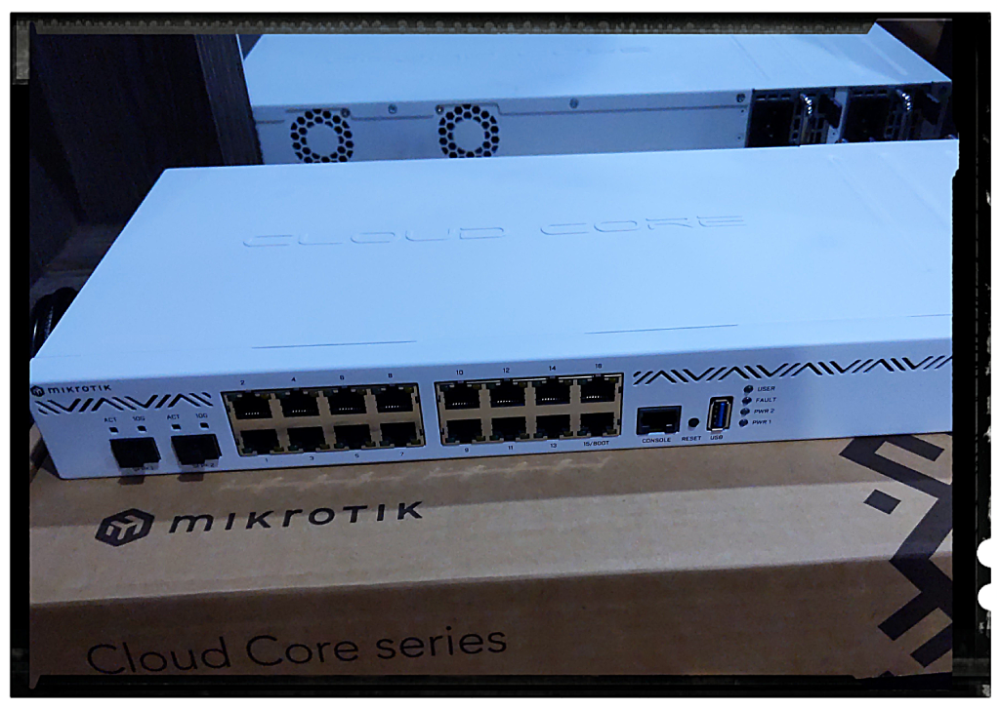

# Networking

## Bandwidth

Dedicated bandwidth connection, providing up to 200Mbps for international
direct land-line and under-sea connections. This service extends all the way to
Singapore, ensuring latency below 30ms. This speed is critical for RPC endpoint
provider operations, where timely data transfer is a crucial success factor.
The provision to scale up our bandwidth capabilities offers us the flexibility
to match our growing needs without compromising on the quality of service.

## Router

[MikroTik Cloud Core Router CCR2004-16G-2S+](https://mikrotik.com/product/ccr2004_16g_2splus)

The CCR2004 router, part of the illustrious MikroTik series, brings several
compelling advantages to the table, ensuring optimal low latency networking
and high throughput suitable for our needs.

- **Decent Performance:** The router leverages the power of the Annapurna
Labs Alpine v2 CPU, which has 4x 64-bit ARMv8-A Cortex-A57 cores. This results
in robust single-core performance, a critical factor when managing operations
that hinge heavily on per-connection processing.

- **Expansive Bandwidth:** The CCR2004 router is well-equipped with 18 wired
ports, incorporating 16x Gigabit Ethernet ports and two 10G SFP+ cages,
providing abundant bandwidth capacity. This specification enables the router
to efficiently manage high data traffic, thus delivering enhanced throughput.

- **Zero Bottlenecks:** The unique design of the CCR2004 router ensures no data
flow bottlenecks. Each group of 8 Gigabit Ethernet ports is connected to a
distinct Marvell Amethyst family switch-chip, each having a separate 10 Gbps
full-duplex line to the CPU. This structure ensures all ports can operate at
full wire speed, as long as the CPU can handle the processing, ensuring low
latency and high throughput.

- **Incredible Single-Core Performance per Watt:** The CCR2004 router offers
the best single-core performance per watt across all CCR devices. This efficient
operation results in higher processing power per unit of energy consumed,
handling a more substantial load, thereby offering low latency and high throughput.

- **Reliability and Durability:** Encased in a classic white 1U rackmount,
the CCR2004 incorporates built-in dual redundant power supplies. This
redundancy ensures that even if one power supply falters, the other
continues operations, promising uninterrupted service.
