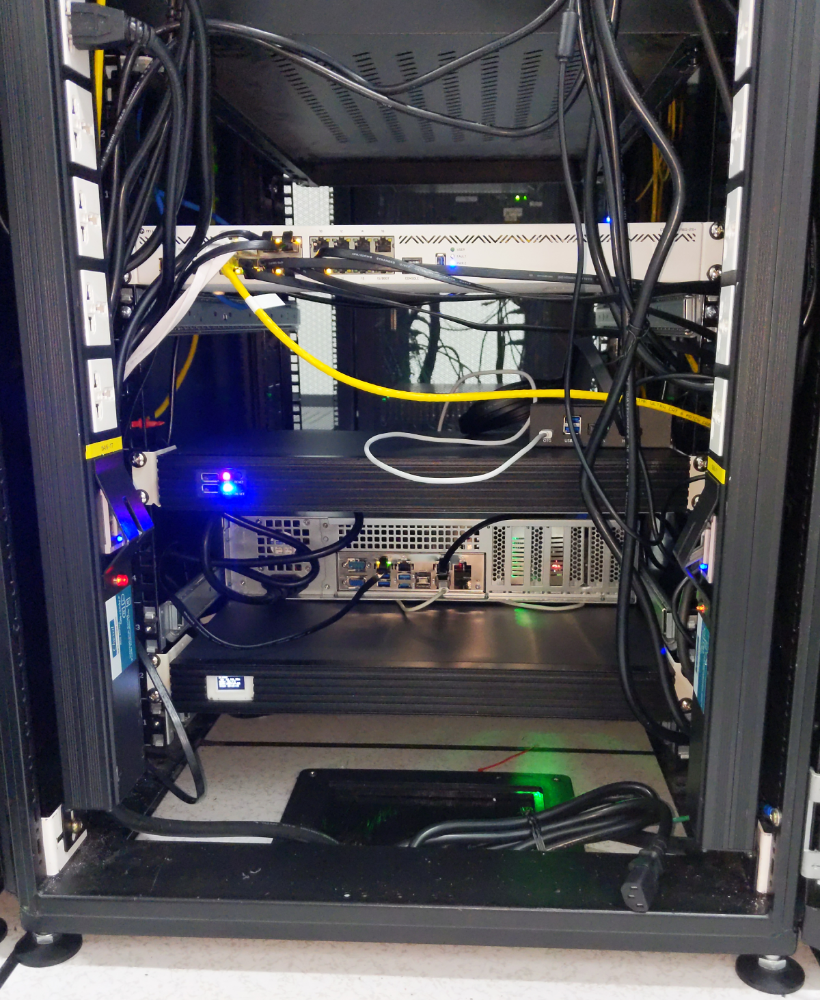

# Networking

## Bandwidth

We operate a dedicated bandwidth connection providing up to 200Mbps for
international direct land-line and under-sea connections. This service extends
all the way to Singapore, ensuring latency below 30ms. This speed is critical
for RPC endpoint provider operations, where timely data transfer is a crucial
success factor. The provision to scale up our bandwidth capabilities offers
us the flexibility to match our growing needs without compromising on the
quality of service.

## Router

[MikroTik Cloud Core Router CCR2004-16G-2S+](https://mikrotik.com/product/ccr2004_16g_2splus)

We use the [MikroTik Cloud Core Router CCR2004-16G-2S+](https://mikrotik.com/product/ccr2004_16g_2splus) for its
optimal low latency networking and high throughput capabilities.

- **Performance:** The CCR2004 router uses the Annapurna Labs Alpine v2 CPU,
  which has 4x 64-bit ARMv8-A Cortex-A57 cores for robust single-core
  performance.
- **Bandwidth:** The router has 18 wired ports, including 16x Gigabit Ethernet
  ports and two 10G SFP+ cages for high data traffic management.
- **No Bottlenecks:** Each group of 8 Gigabit Ethernet ports is connected to a
  distinct Marvell Amethyst family switch-chip, each having a separate 10 Gbps
  full-duplex line to the CPU for full wire speed operation.
- **Single-Core Performance per Watt:** The CCR2004 router offers the best
  single-core performance per watt across all CCR devices.
- **Reliability and Durability:** The CCR2004 router, encased in a classic
  white 1U rackmount, incorporates built-in dual redundant power supplies for
  uninterrupted service.

## IPv4 Configuration

Our subnet, based on the CIDR notation of 255.255.255.248 (/29), provides us
with 6 usable IP addresses, from 27.131.160.105 to 27.131.160.110, out of a
total of 8. The first address, 27.131.160.104, is the network address, and the
last one, 27.131.160.111, is the broadcast address. They can't be used for
hosts (like our router or nodes). 

We currently use the following configuration:

- **Network Address:** 27.131.160.104
- **Gateway (ISP's router):** 27.131.160.105
- **Our Router's WAN Interface:** 27.131.160.106
- **Usable addresses for nodes:** 27.131.160.107 to 27.131.160.110
- **Broadcast Address:** 27.131.160.111

