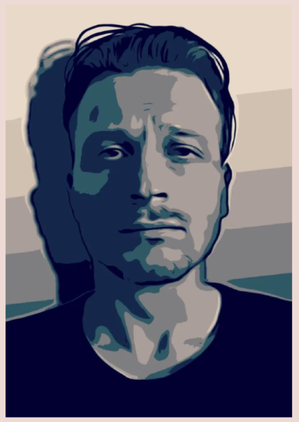
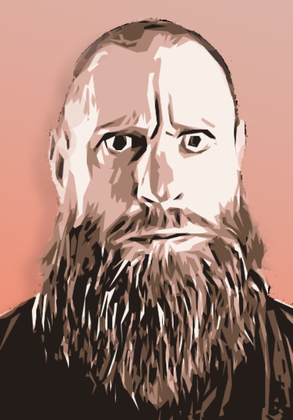
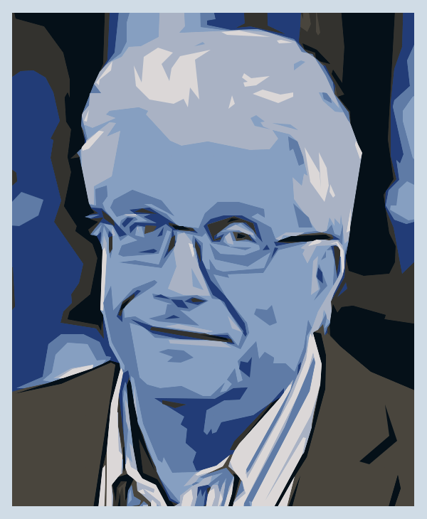

<h1>Team</h1>

<h3>Tommi</h3>

 

Tommi is a symbol of the generation that mastered the qwerty keyboard even
before grasping the intricacies of handwriting. With over 20 years of
experience in building hardware, software, and managing servers during the
early stages of the internet, he demonstrates an exceptional commitment to
the digital world.

Tommi's journey with Bitcoin started as early as 2008. He ran the first
version of Bitcoin on a Pentium D950 computer, only to lose the digital keys
within a few months. This experience gave him a first-hand insight into the
workings of the novel digital currency.

However, it wasn't until 2013, when Snowden's revelations and the growing
influence of anonymous online marketplaces came to light, that Tommi fully
grasped the importance of Bitcoin's proposition. The internet, once thought
of as a user-driven landscape, had allowed a mere ten companies to gain
majority control, leading to concerns about mass surveillance.

This eye-opening realization led to the creation of Rotko Network. This
initiative is based on the principle of creating an internet that is shaped
by its users, rather than dominated by a few profit-driven corporations. With
the dedication of a software enthusiast and the heart of a freedom-fighter,
standing at the helm of this mission. He is dedicated to end the data
slavery and reshaping the internet into a space that truly belongs to its
users.
  wq!

<!-- 
 

<!-- flex-direction: column; flex: 0 0 20%;"> 
<!-- alt="Dan" style="width: 100%; margin-top: 1em; object-fit: cover;"> -->
<!-- 
<h3>Dan</h3>
 
 
 
 Meet -->
<!-- Dan, a bona fide wizard of programming who cut his teeth coding back in the -->
<!-- 90s, drawing inspiration from the music demoscene. With more than two decades -->
<!-- under his belt, he's a seasoned veteran who understands the ins and outs of the -->
<!-- game. -->
<!---->
<!-- Just like many of us old-timers, he has a deep appreciation for functional -->
<!-- programming and a penchant for clarity in code, with Rust being his go-to -->
<!-- tool. He's got this knack for building software that runs as close to the -->
<!-- metal as possible, extracting every bit of performance he can get.  -->
<!---->
<!-- One of his remarkable feats is constructing intricate drum machines entirely -->
<!-- from scratch, a testament to his understanding of complex systems and -->
<!-- algorithmic creativity. He’s not just a coder; he’s a craftsman. 
 
 -->
<!-- 
 -->
<!---->
<!-- 
 

<!-- flex-direction: column; flex: 0 0 20%;"> 
<!-- alt="Mikko" style="width: 100%; margin-top: 1em; object-fit: cover;"> -->
<!-- 
<h3>Mikko</h3>
 
 
 
 With -->
<!-- over 40 years of diverse and significant technical experience, Mikko is the -->
<!-- ideal advisor for creating Internet and networking infrastructure at Rotko -->
<!-- Networks. His expertise spans across all technical layers, from layer 1 -->
<!-- hardware programming to layer 7 application interfaces, making him an essential -->
<!-- asset, especially considering the CEO's top-to-bottom learning path. -->
<!---->
<!-- His technical journey began in the mid-1980s at Nokia Mobile Phones, where he -->
<!-- hand-wrote UI with NEC's Assembly without a compiler, demonstrating a profound -->
<!-- understanding of low-level programming. His most notable achievement at Nokia -->
<!-- was the invention of the menu buttons on the display, a pioneering feature that -->
<!-- has become ubiquitous in mobile user interfaces. -->
<!---->
<!-- One of the most noteworthy roles was serving as the IT Manager at the -->
<!-- University of Turku, where he was responsible for managing and upgrading the -->
<!-- entire IT infrastructure, including modern Data Center and network services. He -->
<!-- implemented crucial projects like Datacenter upgrades, WLAN enhancements, -->
<!-- network topology redesigns, and developed vital services such as private cloud -->
<!-- storage and learning platforms. -->
<!---->
<!-- His profound knowledge of technologies like Novell NetWare, AD, MS Exchange, -->
<!-- backup and storage systems, IIS, ISA Firewall, DNS, and DHCP, coupled with his -->
<!-- broad understanding of both low-level and high-level systems, makes him a -->
<!-- tremendous asset for Rotko Networks. His broad and deep technical expertise -->
<!-- ensures he will provide significant guidance in building a robust and efficient -->
<!-- Internet and networking infrastructure. 
 
 
 -->

